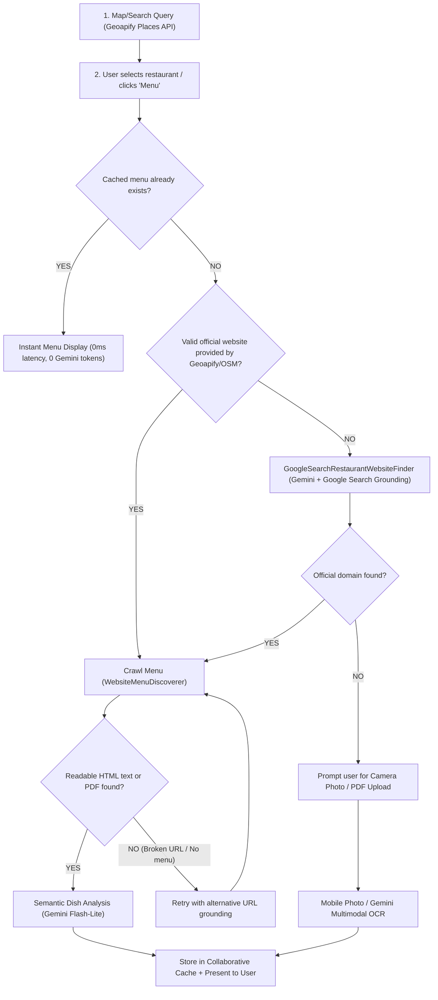

# Vegan Tools — Architecture & Engineering Guide

This document provides a comprehensive technical overview of the **Vegan Tools** platform architecture, data flows, restaurant discovery lifecycle, and deployment infrastructure.

---

## 🏗️ 1. High-Level System Architecture

Vegan Tools is built as a TypeScript monorepo with high separation of concerns:

```text
vegan-tools/
├── apps/
│   ├── api/          # Node.js + Fastify backend server
│   │                 # - Geoapify & OpenStreetMap place search
│   │                 # - Gemini 2.5 / 3.0 / 3.1 Flash-Lite extraction & OCR
│   │                 # - Google Search Grounding for official website resolution
│   │                 # - Deterministic HTML/PDF web crawler with SSRF protection
│   │                 # - Supabase PostgreSQL + Storage persistence
│   └── web/          # React 19 + Vite + TailwindCSS frontend
│                     # - Leaflet interactive map with custom clustering & anchor pins
│                     # - PWA service worker with offline precaching
│                     # - Bilingual i18n (Catalan & English)
│                     # - Adaptive 420ms search debouncing & bottom sheet UX
├── packages/
│   └── domain/       # Pure domain logic & shared Zod schemas
│                     # - Ingredient dictionary & deterministic rule engine
│                     # - Restaurant candidate & menu data structures
│                     # - Review scoring & aggregate stats schemas
└── supabase/         # PostgreSQL schema migrations & storage bucket definitions
```

---

## 🧭 2. Restaurant Search & Menu Discovery Lifecycle

The core value proposition of Vegan Tools is providing **verified, auditable menu sources** directly from the restaurant's primary website or physical menu, rather than relying on stale third-party reviews.

### End-to-End Discovery Pipeline



### Detailed Pipeline Stages

#### Stage 1: Location & Place Search (`GET /v1/restaurants/search`)
1. **Debounced Querying**: The frontend debounces user input by **420 ms** before dispatching a search request.
2. **Primary Provider (Geoapify Places API v2)**:
   - Queries `https://api.geoapify.com/v2/places` with categories `catering.restaurant`, `catering.cafe`, `catering.fast_food`, `catering.bakery`, `catering.ice_cream`.
   - Filters by circular coordinates (`circle:lon,lat,radius`) with proximity bias.
   - Extracts structured diet tags (`diet.vegan`, `diet.vegetarian`) and official contact URLs.
3. **Transparent Fallback (OpenStreetMap + Curated List)**:
   - If `GEOAPIFY_API_KEY` is not present or rate-limited, queries the curated in-memory catalog, Komoot Photon, and Overpass spatial APIs.

#### Stage 2: Official Website Resolution (`POST /v1/restaurants/resolve`)
1. **Cache Verification (`RestaurantMenuCache`)**: Checks if the restaurant menu was already analyzed by any user. If found, returns immediately.
2. **Website Validation**: If a valid official website URL is already attached, it proceeds to crawling.
3. **AI Grounding (`GoogleSearchRestaurantWebsiteFinder`)**:
   - If the website is missing or comes from an aggregator (e.g. TripAdvisor, TheFork, Glovo, Instagram), the backend invokes **Gemini Flash-Lite with real-time Google Search Grounding** (`tools: [{ googleSearch: {} }]`).
   - Filters out third-party directories and extracts only the restaurant's own official domain or direct menu page.

#### Stage 3: Deterministic Crawling (`WebsiteMenuDiscoverer`)
1. Fetches the homepage and extracts navigation links matching menu keywords (`/carta`, `/menu`, `/plats`, `/food`, `/dishes`, `.pdf`).
2. Follows links up to depth 2, downloads HTML/PDF, strips headers/footers/cookies, and scores visible text.
3. Enforces strict **SSRF protection** against private subnets (`127.0.0.1`, `10.0.0.0/8`, `192.168.0.0/16`, AWS metadata `169.254.169.254`).

#### Stage 4: Semantic Analysis & Collaborative Caching (`MenuAnalyzer`)
1. The extracted clean text or PDF/image is sent to **Gemini Flash-Lite** with vegan classification rules.
2. Dishes are categorized into `VEGAN`, `VEGETARIAN`, or `NOT_VEGAN` with allergens and substitution hints.
3. Results are saved to **Supabase** / shared cache so subsequent users receive instant results.

#### Fallback: Physical Menu / Blackboard OCR
- When a restaurant has zero digital presence, users can snap a photo with their phone. Gemini multimodal OCR processes the photo in ~1.5 seconds and saves it for the community.

---

## 🔒 3. Security & Privacy Architecture

- **Zero-Tracking & GDPR Compliance**: User GPS coordinates and search queries are processed ephemerally in-memory and never stored in user profiles or sold to advertisers.
- **SSRF (Server-Side Request Forgery) Defense**: The web crawler strictly blocks private IP ranges, local loopbacks, and non-HTTP protocols.
- **Storage Lifecycle**: User-uploaded raw menu originals in Supabase Storage are automatically marked with an expiration retention policy.

---

## ⚙️ 4. Environment Variables Reference

| Variable | Purpose | Example |
| :--- | :--- | :--- |
| `GEOAPIFY_API_KEY` | Primary restaurant search and place details | `a1b2c3d4e5f6...` |
| `GEMINI_API_KEY` | Google GenAI API key for OCR, search grounding, and dish classification | `AIzaSy...` |
| `GEMINI_MODEL` | Primary LLM for menu extraction and dish analysis | `gemini-3.1-flash-lite` / `gemini-2.5-flash` |
| `GEMINI_WEBSITE_MODEL` | Model for official website search grounding | `gemini-3.1-flash-lite` |
| `DEFAULT_RESTAURANT_NEAR` | Default city bias when searching without location | `Barcelona` |
| `WEB_ORIGIN` | Allowed CORS origins for API requests | `https://vegantools.org,http://localhost:5173` |
| `VITE_API_URL` | API base URL for the frontend bundle | `https://api.vegantools.org` |
| `SUPABASE_URL` | Supabase PostgreSQL project URL | `https://xyzcompany.supabase.co` |
| `SUPABASE_SECRET_KEY` | Supabase server secret key (`service_role`) | `sb_secret_...` |
| `MENU_SOURCE_DIR` | Local disk fallback for menu uploads when Supabase is disabled | `./data/menu-sources` |

---

## 📡 5. API Endpoints Reference

### Restaurants & Discovery
- `GET /health` — Health check endpoint (`200 OK`).
- `GET /v1/location/approximate` — Fast zero-cost IP geolocation via Cloudflare/Render headers.
- `GET /v1/restaurants/curated` — Featured curated restaurants sorted by user distance.
- `GET /v1/restaurants/search` — Search restaurants by name, keywords, radius, and coordinates.
- `POST /v1/restaurants/resolve` — Resolve place identity and verified official website via AI search grounding.

### Menus & OCR
- `POST /v1/menus/discover` — Crawl restaurant website to extract HTML menus or PDF links.
- `POST /v1/menus/analyses` — Start AI extraction of uploaded PDF or image menu files.
- `GET /v1/menus/analyses/:id` — Poll extraction progress and retrieve structured draft.
- `PATCH /v1/menus/analyses/:id` — Edit dish details, names, prices, or dietary verdicts.
- `POST /v1/menus/:id/dishes/:dishId/feedback` — Submit community dish correction with bilingual polishing.
- `POST /v1/menus/:id/notes` — Save restaurant community notes (`communityNotes`, `communityNotesCa`).
- `POST /v1/menus/:id/publish` — Publish menu with a public slug.
- `GET /v1/public/menus/:slug` — Read published menu without requiring edit tokens.
- `GET /v1/menu-sources/:menuId/:storedName` — Stream original uploaded source PDF/image.

### Reviews & Community
- `GET /v1/restaurants/:restaurantId/reviews` — Fetch paginated reviews and leaf score statistics.
- `POST /v1/restaurants/:restaurantId/reviews` — Submit or update an authenticated review (1–5 leaves).
- `DELETE /v1/restaurants/:restaurantId/reviews` — Delete a user's own review.

### Products & Ingredients
- `GET /v1/products/:gtin` — Retrieve product details and vegan classification by barcode (Open Food Facts).
- `POST /v1/products/:gtin/evidence` — Submit user-verified product evidence.
- `POST /v1/ingredients/classify` — Deterministically classify raw ingredient text.
- `POST /v1/ingredients/extract` — OCR ingredient text from a photographed product label.
- `POST /v1/recipes/veganize` — Substitute non-vegan ingredients with plant-based alternatives.

---

## 🚀 6. Production Deployment

### Frontend (Render Static Site / Cloudflare Pages)
- **Root Directory**: `/`
- **Build Command**: `npm run build -w @vegan-tools/domain && npm run build -w @vegan-tools/web`
- **Publish Directory**: `apps/web/dist`
- **Environment**: `VITE_API_URL=https://vegan-tools-api.onrender.com`
- **SPA Rewrite**: `/*` → `/index.html`

### Backend (Render Web Service)
- **Runtime**: Node.js (v22+)
- **Build Command**: `npm ci && npm run build -w @vegan-tools/domain && npm run build -w @vegan-tools/api`
- **Start Command**: `npm run start -w @vegan-tools/api`
- **Keep-Alive**: Set up an external uptime ping (e.g. `cron-job.org` or `Better Stack`) to `/health` every 10–14 minutes during active hours to avoid free-tier cold starts.
